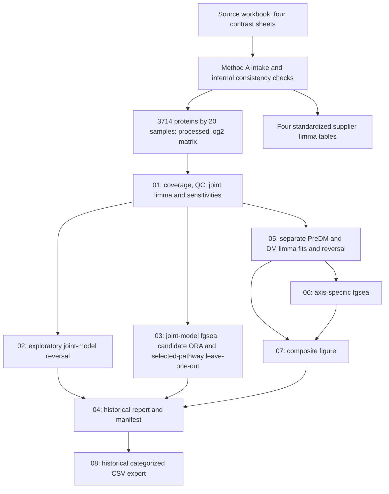

# Pipeline reconstructed from the archived code

## Analysis boundary and lineage

Source archive SHA-256: `92d8500aac01bcd97f40fc9fe71ac8fb2a84f7b7dc290300eb9fd869a7949582`.
Source workbook SHA-256: `318805e98f9035ce37d3ecb9b480d73862813c41c88e8d666daffe0e1584067d`.

The two workbook copies are source provenance, not raw instrument files. Four sheets contain protein annotations, processed log2 sample abundances, log2FC, raw P, adjusted P and -log10(P). Repeated sample measurements agree across sheets. The archive does not contain the upstream search/quantification workflow or the code/record that confirmed biological metadata between Method A and B.

The packaged portable runner follows `01 → 02 → 03 → 05 → 06 → 07`. It creates an execution summary in place of running the historical finalizer. Both original Python finalization/export scripts remain in `legacy/`; the untouched historical launcher is in the private archive.

## Sample and contrast naming

| Workbook label | Method A group | Method B group | Meaning recorded in archive |
|---|---|---|---|
| CTL | CTRL | CTRL | Control |
| PDM | PDM | PreDM | Prediabetes |
| DM | DM | DM | Diabetes |
| PDM-Treated | PDM_Treated | PreDM_Dapa | Prediabetes + dapagliflozin |
| DM-Treated | DM_Treated | DM_Dapa | Diabetes + dapagliflozin |

Sample IDs retain `EXT_PDM_*` and `EXT_PDM_Treated_*` even in Method B. Join using exact sample IDs, and use Method B's group column for modeling. D1 and D2 refer to different disease stages between Methods A and B; T1/T2 also switch stage order. Compare biological contrasts, not the D1/T1 prefix.

## Method A: processed-data intake

`pipeline/20_external_limma_intake.py` reads XLSX ZIP/XML directly because eight drawing/VML targets referenced by the workbook are missing. It enforces four named sheets, 3,714 unique accessions per sheet and eight numbered sample columns per sheet. It reconstructs 20 unique samples, compares repeated values and annotations, and calculates consistency errors for complete-row mean differences and -log10(P). It writes abundance, annotation, metadata, standardized contrast tables and provenance. Its source P values are imported, not refitted. The old validator reports arithmetic errors without applying fail thresholds; the independent audit additionally recomputed BH.

## Method B: execution stages

| Stage | Implemented operations | Important parameters / outputs |
|---|---|---|
| `01_qc_dea.R` | Joint coverage filtering; missingness, median/IQR, correlations; PCA and watchlist; joint limma; sensitivity and leave-one-out fits | Keep ≥3 observed samples in at least one group; all 3,714 retained. PCA uses per-protein median replacement and centered, unscaled features. No primary DEA imputation or additional log transform. Seed 48. |
| Joint limma within 01 | `~0+group`, `lmFit`, contrasts, `eBayes(trend=TRUE, robust=TRUE)` | Nine contrasts; BH per contrast. Formal flag: q<0.05 and observed |log2FC|≥0.25. Supportive: q<0.10, same effect filter. Candidate: raw P<0.05 and |log2FC|≥0.58. |
| Sensitivities within 01 | Median centering, KNN k=5, stochastic left-shifted normal fill, leave one sample out | Downshift uses sample median−1.8 SD, width 0.3 SD, despite the label “MinDet”. Primarily summarized by effect correlations, sign agreement and candidate counts. All 20 omissions contribute to candidate-stability aggregation. |
| `02_reversal.R` | Join disease and direct-treatment effects; reversal ratio and candidate sets; sample scores | RI=−treatment logFC/disease logFC for |disease logFC|≥0.25. Raw-P selected proteins; top-50 fallback if <5. Welch and fixed-score enumeration are exploratory and selection-biased. |
| `03_enrichment.R` | Gene-rank enrichment, candidate ORA, selected treatment pathway stability | msigdbr rat symbols, KEGG_LEGACY/Reactome/Hallmark; signed −log10(P), maximum absolute rank for duplicate symbols; overlap sizes 5–500; fgseaMultilevel eps=0; BH within each collection/contrast. ORA uses measured mapped genes as background, BH before removing zero overlaps. |
| `05_axis_specific_limma.R` | Separate three-group 12-sample fits; disease, treatment, residual contrasts; two-contrast omnibus F test; reversal and sample scores | ≥3 observed samples in each relevant group: 3,635 PreDM and 3,601 DM proteins. Same limma settings. Shared CTRL means fits are not statistically independent. |
| `06_axis_specific_enrichment.R` | Four disease/direct-treatment rank-enrichment analyses from axis fits | Same rank collapse, collections and set-size limits as 03; no axis-specific pathway leave-one-out implemented. |
| `07_reference_reversal_figure.R` | RI distribution, selected protein reversal heatmap and pathway panels | Top disease candidates and selected pathways, including fallback top-ranked pathways; PDF/PNG/TIFF plus exact plotted source tables. |
| `legacy/04_finalize.py` | Historical Markdown report, gates, RO-Crate stub, runtime and manifest | Uses hardcoded assertions and depends on optional files; inspection only in recovered runner. |
| `legacy/08_build_csv_export.py` | Categorized CSV/figure handoff and ZIP | Separate packaging utility, absent from historical `run_all.sh`; not part of the statistical model. |

## Joint contrasts

The four main contrasts are PreDM−CTRL, DM−CTRL, PreDM_Dapa−PreDM and DM_Dapa−DM. Additional contrasts are PreDM_Dapa−CTRL, DM_Dapa−CTRL, DM−PreDM, DM_Dapa−PreDM_Dapa, and `(DM_Dapa−DM)−(PreDM_Dapa−PreDM)`. The last contrast is the stage-by-treatment interaction. Its minimum FDR is 0.98498; differences in significance between stage-specific fits do not establish a stage-dependent treatment effect.

## Missing components

No raw-MS workflow, identification-FDR controls, upstream normalization/imputation provenance, tissue/batch/sex/age/dose/duration records, documented prespecified analysis plan, historical R dependency lock or full pathway database snapshot was found. Those gaps limit biological appraisal and exact reproduction. A joint fit RDS is preserved; axis-specific fit objects are not saved by their script.
